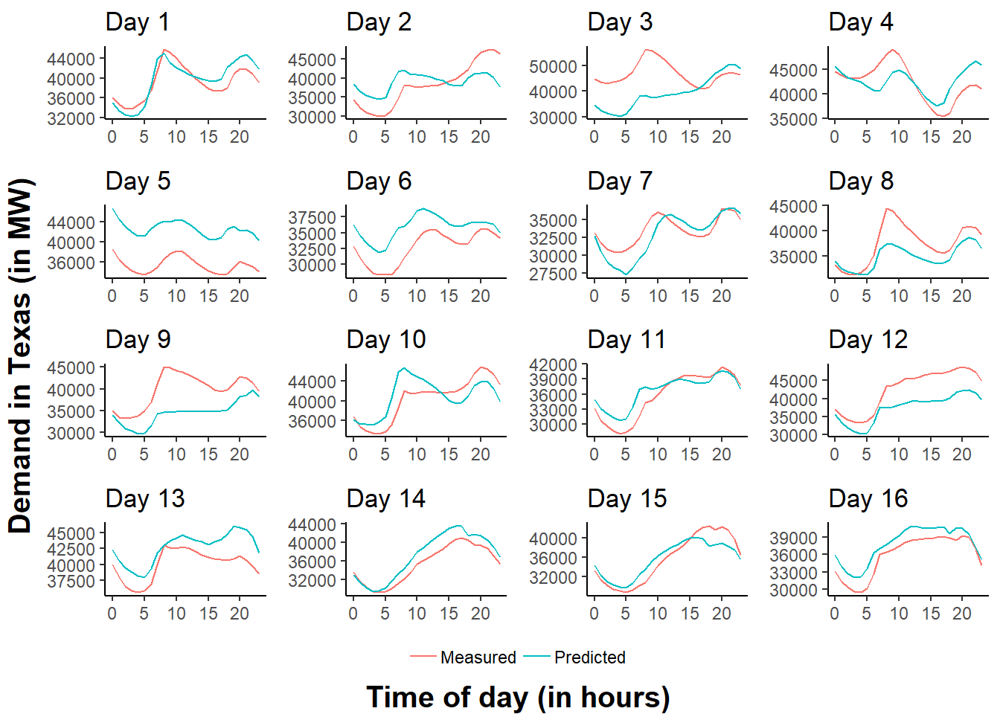

<!-- README.md is generated from README.Rmd. Please edit that file -->

# Electricity Load Prediction in Texas

## Introduction

How do electric companies know how much power they have to generate?
They constantly keep track of how much energy is being consumed and many
times it is very predictable as we will demonstrate in this analysis.
The main goal of this analysis is to see if we can predict the next 24
hours of electricity consumption using past historical data.

Why is it important to predict hourly demand for electricity at least a
day in advance? You need to know much generators needs to be on to meet
the expected demand and turning on a generator requires time (to ramp
up/down). If you underestimate the load demand then there would be
places without power and will have far reaching consequences. If you
overestimate by a large margin then energy produced would be wasted and
you would ‘lose’ money (i.e more supply than demand).

## Libraries/packages we will be using

``` r
library(ggplot2)
library(stringr)
library(caret)
library(cowplot)
library(grid)
library(gridExtra)
```

## Load the ERCOT 2018 data

Let’s see how does load vary over the year in Texas.


For fun, let’s look at the production of wind energy of the year.


Wind Power looks very sporadic while electricity demands seems to have a
trend.


The white square in Mar 11 @ 2:00 indicates a missing data point. March
is typically spring time so loads are not considered to be high and
colors show a trend: low load during the mornings and weekends, high in
the afternoon and evenings in the weekdays.


The summer season in Texas can get very hot so many people would be
using there air conditioning systems which leads to increased demand for
electricity. We see a similar trend as in March: low in the mornings,
high in the afternoon and evenings. Now we don’t we the difference in
weekday vs weekend, now there seems to be no difference depending on the
day of the week.

## Demand Prediction Strategy and Data Aggregation

Based on our observations from the graphs and heatmap, We don’t want to
use a linear regression to fit a line through the data, so we will
predict each hour instead. Therfore to predict effectively, We will use
past week, past 2 days, past 1 day to predict the electiricty demand of
tomorrow. i.e days to train on \(d - 7\), \(d - 2\), \(d - 1\), to
predict load on day \(d\).

``` r
daysToTrainOn = c(-7,-2,-1)
rangeOfDays = seq(-min(daysToTrainOn), numberOfDays - 1, by = 1)
Y = NULL
for (day in rangeOfDays) {
  Y = rbind(Y, dfDemand$ERCOT.Load..MW[(day * 24): ((day + 1) * 24 - 1)])
}
X = NULL
for (day in rangeOfDays) {
  X_temp = cbind(t(dfDemand$ERCOT.Load..MW[(((day - 7)*24 +1)):((day - 7 + 1)*24)]),
            t(dfDemand$ERCOT.Load..MW[(((day - 2)*24) +1):((day - 2 + 1)*24)]),
            t(dfDemand$ERCOT.Load..MW[(((day - 1)*24) +1):((day - 1 + 1)*24)]))
  X = rbind(X, X_temp)
}
dim(X)
## [1] 358  72
dim(Y)
## [1] 358  24
X = data.frame(X)
Y = data.frame(Y)
```

Rows is dates and our columns will be the hours in a day. Each day has
24 hours and since we are using days as our features there will be 72
columns for our input X.

After Organzing the data we will start making our training and testing
sets.

Check dimensions of our X and Y sets to see if they are consistent.

``` r
dim(X_train)
## [1] 286  72
dim(X_test)
## [1] 72 72
dim(Y_train)
## [1] 286  24
dim(Y_test)
## [1] 72 24
```

We will train on 286 days and test on 72 days.

## Prediction Using Multiple Linear Regression

Predict Load of tommorrow at hour i based on last 7 days at time i, last
2 days at time i and yesterday at time i where i = {1,2,… 23}

Our regression equation will be:

Demand\_t = intercept + (7days ago)\_t + (2days ago)\_t + (1day ago)\_t
In total there will be 24 linear models; one for each hour of the day.

After setting up our models, we set up the our models to see how they
perform with the testing dataset.

``` r
data <- list(dat0 = list(model = mod0, test = newdat0),
             dat1 = list(model = mod1, test = newdat1),
             dat2 = list(model = mod2, test = newdat2),
             dat3 = list(model = mod3, test = newdat3),
             dat4 = list(model = mod4, test = newdat4),
             dat5 = list(model = mod5, test = newdat5),
             dat6 = list(model = mod6, test = newdat6),
             dat7 = list(model = mod7, test = newdat7),
             dat8 = list(model = mod8, test = newdat8),
             dat9 = list(model = mod9, test = newdat9),
             dat10 = list(model = mod10, test = newdat10),
             dat11 = list(model = mod11, test = newdat11),
             dat12 = list(model = mod12, test = newdat12),
             dat13 = list(model = mod13, test = newdat13),
             dat14 = list(model = mod14, test = newdat14),
             dat15 = list(model = mod15, test = newdat15),
             dat16 = list(model = mod16, test = newdat16),
             dat17 = list(model = mod17, test = newdat17),
             dat18 = list(model = mod18, test = newdat18),
             dat19 = list(model = mod19, test = newdat19),
             dat20 = list(model = mod20, test = newdat20),
             dat21 = list(model = mod21, test = newdat21),
             dat22 = list(model = mod22, test = newdat22),
             dat23 = list(model = mod23, test = newdat23))
```

## Results

Sanity check to see if the number of predictions we have matches the
number of measured values in the test set.

``` r
predictions = sapply(data, function(dat) predict(dat$model, newdata = dat$test))
dim(predictions)
## [1] 72 24
dim(Y_test)
## [1] 72 24
```

Let’s visualize our results Here we choose the first 16 days to see how
good our predictions were.

Overall, it seems to be predicting reasonbly well for a linear model.
Though there are some days like day 2 where our model performed poorly.
Generally, it is okay to overestimate alittle but it is not good to
underestimate.

### Testing Accuracy using Min-Max (closer to 1, the better)

``` r
min_max <- mean(apply(act_pred, 1, min) / apply(act_pred, 1, max))
print(min_max)
## [1] 0.8081446
```

81% testing accuracy not bad\!

### Other Assessment Metrics

``` r
source('Functions.R')
error = act_pred$actuals - act_pred$predicteds
mae(error) # Mean Absolute Error
## [1] 9991.805
rmse(error) # Root Mean Squared Error
## [1] 12886.66
```

Both the MAE and RMSE is relatively low because the mean absolute error
and the maximum load demand is very different and far from each other.

## Conclusion/Future Work

We have shown a simple way to predict electricity demand while getting
very reasonable accuracy. How ERCOT actually predicts energy consumption
is definitely a lot more sophisticated than our simple model but the
main principles remains the same. We use past data to predict the
future, it is impossible to predict the future with impeccable accuracy
but we can do better than just guessing. As for potential room for
improvement and future work, we could explore more advanced prediction
methods such as using a neural network, or times series model. The code
written could be optimized better and done with fewer lines. We might
also want to try matching the dataset with a weather dataset and use
temperature as an additional feature in our models.
